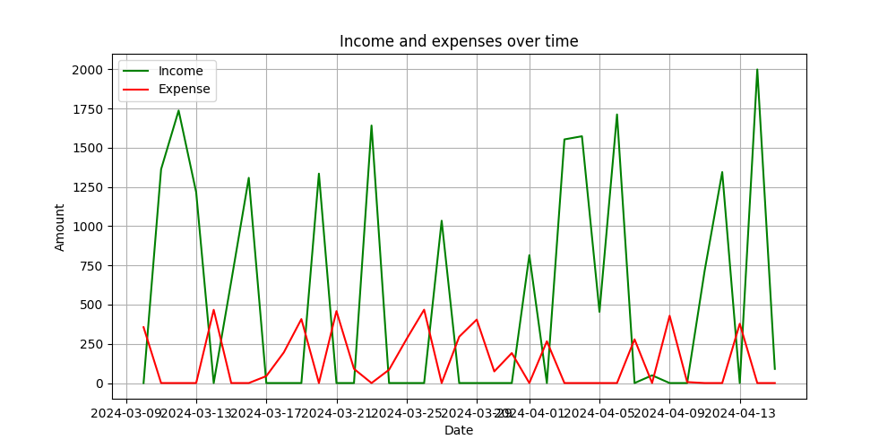

# 📊 Personal Finance Tracker - README.md

Welcome to the **Personal Finance Tracker**! This simple yet effective Python project helps you track your income, expenses, and savings over time, making it easier to manage your finances. 💰✨.
This project has real-world applications and business potential:
1. **Budgeting Tools:** This can be extended into a full-fledged personal budgeting app.
2. **Financial Analytics:** Add insights and recommendations for users based on their spending habits.
3. **Mobile Integration:** Convert this into a mobile or web app for enhanced accessibility.
4. **Subscription Services:** Offer premium features like automatic expense categorization, cloud storage, and advanced reporting.

---

## 🚀 Features
1. **Add Transactions:** Easily add income and expense entries.
2. **View Transaction Summary:** Get a detailed summary of your transactions within a specified date range.
3. **Visualize Data:** Generate a line plot to see income and expenses trends over time.

---

## 🛠️ Concepts and Tools Used
This project demonstrates several Python concepts like OOPS and tools:
- **File Handling with CSV:**
  - Stores all transaction data in a CSV file for easy access and persistence.
- **Pandas Library:**
  - Used for data manipulation and filtering.
- **Matplotlib Library:**
  - Generates visual representations of financial data.
- **Datetime Module:**
  - Handles date conversions and calculations.
- **Custom Modules:**
  - Integrates functions from a custom `data_entry` module for user input.

---

## 🌟 How It Works
1. **Run the Program:**
   - Execute `main()` to start the program. You'll be greeted with a menu to select your desired operation.

2. **Add a Transaction:**
   - Enter the date, amount, category (Income/Expense), and a description. Transactions are saved in a `finance_data.csv` file.

3. **View Transactions:**
   - Specify a date range to filter transactions and get a summary that includes:
     - Total Income
     - Total Expense
     - Net Savings 💸

4. **Visualize Data:**
   - Optionally generate a plot to observe your income and expense patterns over time.

---

## 🚧 Requirements
Make sure you have the following installed:
- Python 3.7+
- Pandas
- Matplotlib

## Let’s Start Tracking! 📅💳

Manage your finances with ease. Run the program and take control of your money today!